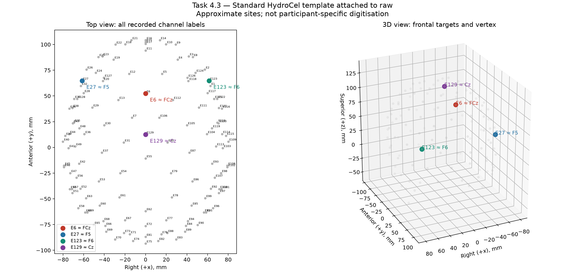

# Frontal theta phase synchrony and post-error slowing

A psychobiological and psychometric investigation of error monitoring in a large open EEG dataset.

Moyosore Olasupo · University of Essex Online · Psychobiology & Neuroscience

## Working revision following supervisor feedback

A [colour review PDF](documents/Research_Proposal_Revised.pdf), [editable Word copy](documents/Research_Proposal_Revised.docx) and [browser copy](documents/Research_Proposal_Revised.html) reproduce the submitted proposal with targeted feedback corrections in red and unconfirmed details in green. This review copy does not approve or implement pending choices. Each green passage is followed by red suggested replacement wording; bracketed governance fields still require verified details. Red methodological passages also have labelled proposed replacement wording beneath them in black.

[Updated proposal — 27 September 2026](documents/Research_Proposal_Revised.md) addresses supervisor feedback with explicit H1/H2 paired tests, a defined connectivity estimator and wavelet settings, H1–H3 Holm correction, an interval-based H4a comparison, H2–H3 interpretation and a dated decision record. It also sets out proposed eligibility/count rules and a data-governance lifecycle. These are documented project recommendations, not supervisor-selected parameters or executed analyses. Actual access, security, backup, retention and review details remain unconfirmed, so the document is not yet submission-ready. The submitted PDF remains unchanged.

## Research specification

The [final submitted research proposal](<documents/Research Proposal Report_submission.pdf>), dated 13 September 2026, defines the current scope. This README distinguishes the submitted plan from the preliminary outputs currently saved in the project. Documentation was reconstructed on 27 September 2026 after file loss.

The primary question is whether participants with stronger error-related frontal theta synchrony show greater post-error slowing (PES). The secondary question is whether error-trial synchrony is more internally consistent than the conventional ΔERN measure at matched usable error-trial counts.

## Hypotheses and analyses

| Analysis | Submitted prediction or purpose | Planned approach |
| --- | --- | --- |
| H1 | Error responses produce more negative FCz amplitude than correct responses. | Compare mean response-locked amplitude at FCz/E6 during 0–100 ms; ΔERN = ERN − CRN. |
| H2 | Frontal theta synchrony is greater on errors than correct responses. | Compare dWPLI within participants using predefined trial-count matching. |
| H3 — primary | Participants with stronger error-trial synchrony show greater PES. | Spearman's correlation between participant-level synchrony and mean valid PES. |
| H4a — secondary | Error-trial dWPLI has higher split-half reliability than ΔERN. | Spearman–Brown correction, matched usable error-trial counts and the same eligible participants within each comparison. |
| H4b — robustness | Assess stability of the H4a comparison across random trial partitions. | Descriptive summaries; repeated-split coefficients are not independent observations. |

PES = RT(E+1) − RT(E−1), using valid correct responses immediately before and after an error (Dutilh et al., 2012; full reference in the submitted proposal).

Neighbours must be identified from the original trial sequence before exclusions. Screening covers omissions, incorrect flanking responses, RT exclusions, block crossings and recording discontinuities. Multiple recordings from the same participant are not independent participants.

The submitted H3 is a single between-participant analysis. A within-participant median-PES split is outside the current submitted scope.

## Data and proposed measurements

The project uses the existing OpenNeuro ds004883 flanker EEG dataset in `data/ds004883_Clayson/`. The proposal describes 172 participants, three flanker variants, 128-channel EGI HydroCel recordings sampled at 500 Hz, and EEGLAB SET/FDT files with behavioural metadata. These source-dataset descriptions are not final analysis sample sizes.

The standard montage provides approximate correspondences E6 ≈ FCz, E27 ≈ F5 and E123 ≈ F6. Proposed connectivity pairs are E6–E27 and E6–E123, with 4–8 Hz theta and a 0–150 ms post-response scoring window. Exact estimator and time–frequency settings remain to be finalised. A scoring window is not the full signal duration required for wavelet estimation.



The electrode figure supports the montage review; it does not establish individual anatomical localisation.

## Current saved progress

The main working record is [h1_pipeline.ipynb](notebooks/h1_pipeline.ipynb). The following status is based on surviving outputs, not a new execution of the analyses.

| Work area | Evidence and limits |
| --- | --- |
| Task 1: behavioural inspection | Notebook inspections address retained behavioural fields, trial sequence, response coding and timing. |
| Task 2: structural counting | Saved exports cover 515 recordings from 172 participants. Counts are provisional structural candidates, not final RT-screened or EEG-eligible PES triplets. |
| Task 3: literature review | Notebook contains reviews supporting the design. Some referenced local PDFs are currently missing; consult the submitted reference list and verify source claims when needed. |
| Task 4: analysis specification | Montage checks, timing/behavioural audits and time–frequency illustrations exist. Several confirmatory decisions remain open. |
| Task 5: preliminary EEG processing | A single reference recording has saved ICA, epoch, ERP and rejection/linkage audits. This is not a group-level H1 result. |

### Provisional behavioural counts

Source: [task summary](results/task2/task_summary.csv) and [output notes](results/task2/output_notes.json).

| Task | Recordings | Structural candidate triplets |
| --- | --- | --- |
| A (`ffa`) | 172 | 10,072 |
| B (`ffb`) | 171 | 5,283 |
| C (`ffc`) | 172 | 6,324 |

The saved notes retain unresolved issues involving final RT screening, practice handling, EEG eligibility, task/block handling and documentary discrepancies. Candidate counts must not be reported as final valid PES counts.

### Descriptive ERP result

The [saved ERP summary](results/task5/sub-1004_ses-1_ern_summary.json) for `sub-1004_ses-1_task-ffb` records 260 retained correct trials and 5 retained errors, with ΔERN approximately −1.126 µV. This describes one recording under the current preprocessing settings; it does not establish H1 or sufficient trials for later analyses.

The [linked epoch audit](results/task5/sub-1004_ses-1_linked_epoch_audit.csv) and [error rejection review](results/task5/sub-1004_ses-1_error_rejection_review.csv) preserve additional evidence. Some older status fields still describe earlier processing stages and must be interpreted alongside the later outputs. No saved group-level hypothesis result was identified during this documentation review.

## Decisions before hypothesis testing

The feedback revision now supplies concrete working choices for the points below. They are not yet implemented in the notebook; review feasibility and document any changes before testing. The list records what must be checked when implementing that revision, rather than overriding its specified values.

- How to handle the three variants and repeated recordings per participant.
- RT exclusions, practice/boundary handling, minimum valid triplets and usable EEG trial thresholds.
- Exact connectivity estimator, wavelet settings, signal duration and electrode-pair aggregation.
- H1/H2 statistical tests, trial-count matching and interpretation of H3 if H2 is unsupported.
- H4 trial-count range, numbers per half, correct-trial sampling, split procedure and inference for the reliability difference.
- Multiple-testing rules and analysis-specific sensitivity assessment.

The submitted proposal does not fix reliability counts at 6, 8, 12 or 16. Counts must be justified from feasibility and methodological evidence before confirmatory testing. Repeated splits describe sensitivity to partitioning and do not create independent datasets.

## Project files

```text
essex_project/
├── documents/              # Original submission and revised proposal formats
├── README.md
├── proposal_summary.md
├── environment.yml
├── data/ds004883_Clayson/   # Source dataset
├── notebooks/h1_pipeline.ipynb
├── scripts/                # Supporting analysis and plotting scripts
├── figures/                # Saved visualisations
└── results/
    ├── task2/              # Provisional behavioural counts and audits
    ├── task4/              # Method and montage checks
    └── task5/              # Reference-recording EEG outputs
```

## Environment and execution

The existing Conda environment is named `essex_project`:

```bash
conda activate essex_project
```

[environment.yml](environment.yml) specifies Python 3.11, MNE >=1.7, mne-bids, NumPy, SciPy, pymatreader and Matplotlib, with a machine-specific prefix. The proposal names MNE-Python 1.12.1 and Picard ICA; the environment file alone neither pins that MNE version nor explicitly includes Picard. Check installed versions before reproducing analyses and record any dependency changes.

Read notebook Markdown and inspect existing outputs before executing cells. Batch-counting or retrieval cells may repeat substantial work during Run All. Saved outputs do not guarantee that a fresh kernel contains their required variables.

Keep source data unchanged and derived outputs outside `data/`. Git-annex paths may exist without their content being locally available; verify SET/FDT availability before loading. Source data must not be committed to the parent project's version-control history.

## Ethics and interpretation

The submitted plan uses de-identified existing data without recruitment or participant contact. It commits to confirming university review arrangements and documenting storage, access and backup safeguards. This README does not establish approval or confirm those safeguards.

Report analysis-specific participant counts and exclusions. PES does not automatically indicate successful adaptation; scalp connectivity does not establish direct anatomical communication; association does not establish causation. Split-half reliability concerns internal consistency, not validity or stability across separate sessions.

The full rationale, limitations, references and indicative 15-week timeline are in the submitted PDF. Planned work and preliminary outputs must remain distinguishable as the project develops.
